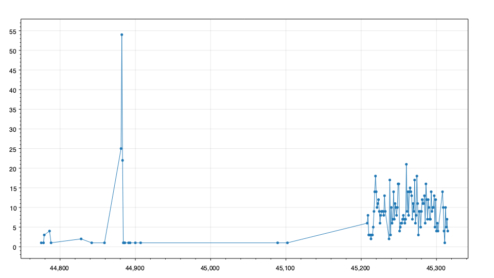
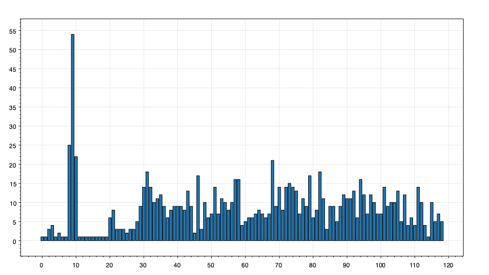
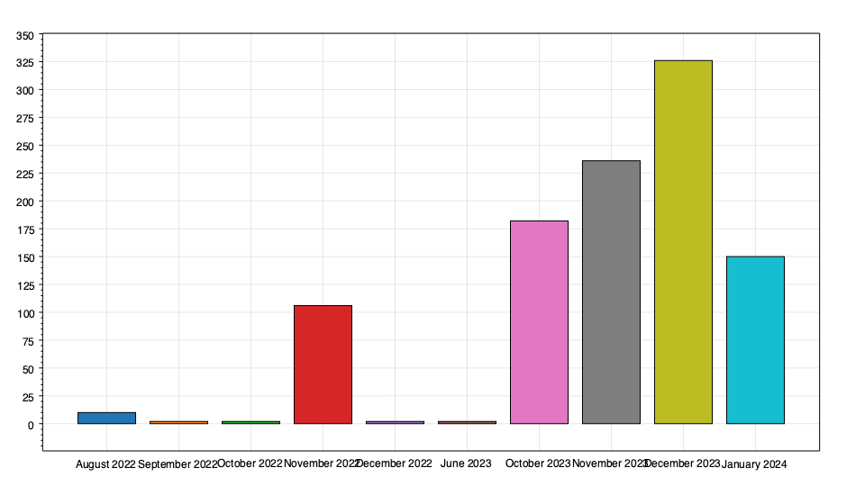
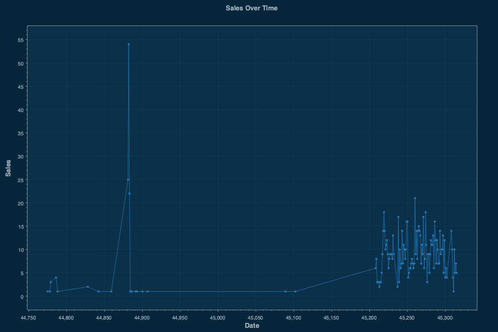

# SQLChart

## What is SQLChart?
SQL Chart is an easy-to-use command-line interface (CLI) tool designed for plotting charts from SQL database data. By simply providing a SQL query and database information, it effortlessly generates visual representations of your data. Unlike other tools, SQL Chart is free from dependencies and does not require interaction with a UI, making it ideal for use in automated scripts.

Main goals of the project:

- CLI-Based: Operates entirely from the command line for seamless integration with scripts and other automated processes.
- No Dependencies: Runs independently without the need for additional software installations.
- Broad Database Compatibility: Works with most SQL databases, including MySQL, SQL Server, PostgreSQL, and SQLite.
- Versatile Charting Options: Offers various chart types and customization options to best represent your data visually.

SQL Chart aims to streamline the process of data visualization for database administrators, developers, and data analysts, particularly in environments where quick, scriptable solutions are required.

## Options

Each option is described below with its purpose and usage:

### Required Options

**Query (--query, -q):** The SQL query to be executed.\
`Example: --query "SELECT date, sales FROM sales_data"`

**Database Type (--db-type, -d):** Specifies the database type. Possible values are MySQL, PostgreSQL, SQLServer, SQLite.\
`Example: --db-type SQLServer`

**Connection String (--connection-string, -c):** The connection string for the database.\
`Example: --connection-string "data source=myHost;user id=myUser;Password=myPass;initial catalog=myDB"`

**Chart Type (--chart-type, -t):** The type of chart to generate. Possible values are Bar, Line, Histogram.\
`Example: --chart-type Line`

**Output (--output, -o):** File path for the output chart.\
`Example: --output "path/to/chart.png"`

### Optional Options

**Title (--title):** Title of the chart. Defaults to empty if not provided.\
`Example: --title "Annual Sales"`

**X-Axis (--x-axis):** Label for the X-axis. Defaults to empty if not provided.\
`Example: --x-axis "Months"`

**Y-Axis (--y-axis):** Label for the Y-axis. Defaults to empty if not provided.\
`Example: --y-axis "Revenue"`

**Width (--width):** Width of the chart in pixels. Default is 960 pixels.\
`Example: --width 1024`

**Height (--height):** Height of the chart in pixels. Default is 540 pixels.\
`Example: --height 720`

**Color Scheme (--color-scheme):** Color scheme for the chart. Possible values are Light, Dark. Default is Light.\
`Example: --color-scheme Dark`

**Database Server (--db-server, -ds):** Address of the database server, required if not using a connection string.\
`Example: --db-server "localhost"`

**Database Name (--db-name, -dn):** Name of the database, required if not using a connection string.\
`Example: --db-name "myDatabase"`

**Database User (--db-user, -du):** Database username, required if not using a connection string.\
`Example: --db-user "username"`

**Database Password (--db-password, -dpw):** Database password, required if not using a connection string.\
`Example: --db-password "password"`

**Help (--help, -h):** Displays help information.\
`Example: --help`

## Example Usage

The following examples all are plotting the same information but in different formats. 

# Line Chart

The following example is a sample use case to draw a line chart.

```
./SqlChart --query "SELECT sale_date, sales_num FROM sales_data Order By sale_date" --db-type SQLServer --connection-string "data source=myHost;user id=myUser;Password=myPass;initial catalog=myDB" --chart-type Line --output "LineChart.png"
```



# Bar Chart

The following example is a sample use case to draw a bar chart.

```
SqlChart --query "SELECT Count(*) FROM sales_data GROUP BY sale_date ORDER BY sale_date" --db-type SQLServer --connection-string "data source=myHost;user id=myUser;Password=myPass;initial catalog=myDB" --chart-type Line --output "BarChart.png"
```



# Histogram Chart

The following example is a sample use case to draw a histogram chart.

```
SqlChart --query "SELECT CONCAT(datename(MONTH, sale_date), ' ', datepart(YEAR, sale_date)) as sales FROM sales_data" --db-type SQLServer --connection-string "data source=myHost;user id=myUser;Password=myPass;initial catalog=myDB" --chart-type Histogram --output "HistogramChart.png"
```



# Optional Options

The following example uses the same example as the last section and adds chart customiztion options such as dark theme and chart and axis titles.

```
SqlChart --query "SELECT sale_date, sales_num FROM sales_data Order By sale_date" --db-type SQLServer --connection-string "data source=myHost;user id=myUser;Password=myPass;initial catalog=myDB" --chart-type Line --output "FancyLineChart.png" --title "Sales Over Time" --x-axis "Date" --y-axis "Sales" --width 1200 --height 800 --color-scheme Dark
```



## Installing From Binary

You can simply download and use the compiled binary program from the releases section of the [GitHub Project](https://github.com/fdmomtaz/SqlChart/releases).

## Build Instructions

Follow these simple steps to build SQL Chart from the source code:

### Prerequisites
Before you begin, ensure you have the following installed:

.NET Core SDK (version 6.0 or later). You can download it from [Microsoft's .NET download page](https://dotnet.microsoft.com/en-us/download).

### Steps to Build

1. Clone the Repository:
First, clone the SQL Chart repository to your local machine using Git.
``
git clone https://github.com/fdmomtaz/SqlChart.git
``

2. Navigate to the Project Directory:
Change to the directory containing the cloned source code.
``
cd SqlChart
``

3. Build the Project:
Use the .NET Core CLI to build the project.
``
dotnet build
``

This command compiles the application and generates executables or DLLs in the `bin` folder.

## Support

If you have any questions, encounter bugs, or need assistance using SQL Chart, please feel free to open an issue on our GitHub Issues page. We welcome your feedback and contributions to help improve SQL Chart.

For more detailed questions or discussions, consider using the Issues section on the GitHub repository. This is a great place to share ideas, ask for help with more complex issues, or discuss potential features.

## Contribution

We welcome contributions to SQL Chart. You can contribute by forking the repository, making your changes, and submitting a pull request. For more detailed instructions.

## License

SQL Chart is open-sourced software licensed under the MIT license.
